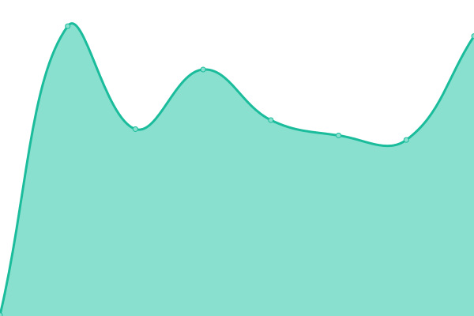

# Hold Status

Uptime monitor and status page for [Hold](https://hold.kanark.com), powered by [Upptime](https://github.com/upptime/upptime).

## Live Status

<!--start: status pages-->
<!-- This summary is generated by Upptime (https://github.com/upptime/upptime) -->
<!-- Do not edit this manually, your changes will be overwritten -->
<!-- prettier-ignore -->
| URL | Status | History | Response Time | Uptime |
| --- | ------ | ------- | ------------- | ------ |
|  [Hold API](https://hold.kanark.com/api/health) | 🟩 Up | [hold-api.yml](https://github.com/kanarkco/hold-status/commits/HEAD/history/hold-api.yml) | 

 116ms
     
 | 

<a href="https://kanarkco.github.io/hold-status/history/hold-api">100.00%</a>
    

<!--end: status pages-->

## How It Works

- GitHub Actions checks the API health every 5 minutes
- Response time is recorded and committed to git
- GitHub Issues are opened automatically for incidents
- Status page is hosted on GitHub Pages

## Status Page

Visit: https://kanarkco.github.io/hold-status

## License

- Code: [MIT](./LICENSE)
- Data in `./history`: [Open Database License](https://opendatacommons.org/licenses/odbl/1-0/)
